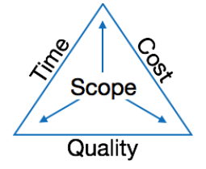

# Software Project Management
The job pattern of an IT company engaged in software development can split in two parts:
 
- Software Creation 
- Software Project Management
 

### What is Project?
A project is well-defined task, which is a collection of several operations done in order to 
achieve a goal.  For example, Software development and delivery.

### How do you characterize a project?
 A Project can be characterized as:
- Every project may has a unique and distinct goal.
- Project is not routine activity or day-to-day operations.
- Project comes with a start time and end time.
- Project ends when its goal is achieved hence it is a temporary phase in the lifetime of an organization. 
`(প্রকল্পটি শেষ হয় যখন এর লক্ষ্য অর্জিত হয়, তাই এটি একটি প্রতিষ্ঠানের জীবদ্দশায় একটি অস্থায়ী পর্যায়।`
- Project needs enough resources in terms of time, manpower, finance, material and knowledge-bank. 
`(প্রকল্পের জন্য সময়, জনবল, অর্থ, উপাদান এবং জ্ঞান-ব্যাংকের ক্ষেত্রে যথেষ্ট সম্পদ প্রয়োজন।)`

### What is Software Project?
A Software Project is the complete procedure of software development from requirement gathering to testing and maintenance, carried out according to the execution methodologies, in a specified period of time to achieve intended software product. 
`(একটি সফটওয়্যার প্রকল্প হলো সম্পূর্ণ সফটওয়্যার উন্নয়ন প্রক্রিয়া, যা চাহিদা সংগ্রহ থেকে শুরু করে পরীক্ষণ এবং রক্ষণাবেক্ষণ পর্যন্ত অন্তর্ভুক্ত থাকে। এটি নির্দিষ্ট বাস্তবায়ন পদ্ধতির মাধ্যমে নির্ধারিত সময়ের মধ্যে পরিচালিত হয়, যাতে কাঙ্ক্ষিত সফটওয়্যার পণ্য অর্জন করা যায়।)`

### Define Software Project Management?
Software project management (SPM) refers to the planning, organizing, and controlling of software development projects. Its primary goal is to deliver high-quality software products on time, within budget, and according to requirements.
 
`(সফ্টওয়্যার প্রজেক্ট ম্যানেজমেন্ট (SPM) বলতে সফ্টওয়্যার উন্নয়ন প্রকল্পের পরিকল্পনা, সংগঠিত এবং নিয়ন্ত্রণকে বোঝায়। এর প্রাথমিক লক্ষ্য হল উচ্চ-মানের সফ্টওয়্যার পণ্য সময়মতো, বাজেটের মধ্যে এবং প্রয়োজনীয়তা অনুযায়ী সরবরাহ করা।)`

### Need of software project management
Software is said to be an intangible product. Software development is a kind of all new stream in world business and there’s very little experience in building software products. Most software products are tailor made to fit client’s requirements. The most important is that the underlying technology changes and advances so frequently and rapidly that experience of one product may not be applied to the other one. All such business and 
environmental constraints bring risk in software development hence it is essential to manage software projects efficiently. 
 
The image above shows triple constraints for software projects. It is an essential part of software organization to deliver quality product, keeping the cost within client’s budget constrain and deliver the project as per scheduled. There are several factors, both internal and external, which may impact this triple constrain triangle. Any of three factor can severely impact the other two.
Therefore, software project management is essential to incorporate user requirements along with budget and time constraints.
 

`(সফটওয়্যারকে একটি অদৃশ্য পণ্য হিসেবে গণ্য করা হয়। সফটওয়্যার উন্নয়ন বিশ্বব্যবসায় একদম নতুন একটি ধারার মতো এবং সফটওয়্যার পণ্য তৈরিতে খুব সামান্য অভিজ্ঞতা রয়েছে। বেশিরভাগ সফটওয়্যার পণ্য গ্রাহকের প্রয়োজন অনুযায়ী তৈরি করা হয়। সবচেয়ে গুরুত্বপূর্ণ ব্যাপার হলো, সফটওয়্যারের ভিত্তির প্রযুক্তি এত দ্রুত এবং ঘন ঘন পরিবর্তিত ও উন্নত হয় যে একটি পণ্যের অভিজ্ঞতা অন্যটির ক্ষেত্রে প্রযোজ্য নাও হতে পারে। এই ধরনের ব্যবসায়িক এবং পরিবেশগত বাধাগুলো সফটওয়্যার উন্নয়নে ঝুঁকি তৈরি করে, তাই সফটওয়্যার প্রকল্পগুলো দক্ষতার সাথে পরিচালনা করা অপরিহার্য।`

`উপরের চিত্রটি সফটওয়্যার প্রকল্পের জন্য ত্রিমুখী সীমাবদ্ধতাগুলোকে দেখায়। একটি সফটওয়্যার প্রতিষ্ঠানের জন্য এটি অপরিহার্য যে তারা একটি মানসম্পন্ন পণ্য সরবরাহ করে, যা গ্রাহকের বাজেটের মধ্যে থাকে এবং নির্ধারিত সময়ের মধ্যে প্রকল্পটি সম্পন্ন হয়। বিভিন্ন অভ্যন্তরীণ ও বাহ্যিক উপাদান এই ত্রিমুখী সীমাবদ্ধতার ওপর প্রভাব ফেলতে পারে। এই তিনটি ফ্যাক্টরের যেকোনো একটি অন্য দুইটির ওপর গুরুতর প্রভাব ফেলতে পারে।`

`তাই, সফটওয়্যার প্রকল্প ব্যবস্থাপনা অপরিহার্য, যাতে ব্যবহারকারীর প্রয়োজনীয়তা বাজেট এবং সময় সীমার সাথে সামঞ্জস্য রেখে অন্তর্ভুক্ত করা যায়।)`

  

### Software Project Manager
একজন সফটওয়্যার প্রকল্প ব্যবস্থাপক হলেন সেই ব্যক্তি যিনি সফটওয়্যার প্রকল্পটি সম্পাদনের দায়িত্ব গ্রহণ করেন। সফটওয়্যার প্রকল্প ব্যবস্থাপক সফটওয়্যারের SDLC (Software Development Life Cycle) এর সকল ধাপ সম্পর্কে পূর্ণ জ্ঞান রাখেন। প্রকল্প ব্যবস্থাপক সরাসরি শেষ পণ্য উৎপাদনে জড়িত না থাকলেও তিনি উৎপাদনের সাথে জড়িত কার্যকলাপগুলো নিয়ন্ত্রণ ও পরিচালনা করেন।

#### Definition:
A software project manager is a person who have the proper knowledge of SDLC and undertakes the responsibility of executing the software project.

 

### Let us see few responsibilities that a project manager shoulders -  

Managing People
- Act as project leader
- Communicate with stakeholders
- Managing human resources  (দলের সদস্যদের নিয়োগ, বরাদ্দ এবং ব্যবস্থাপনা তদারকি করা)
- Setting up reporting hierarchy. (দলের মধ্যে যোগাযোগ এবং রিপোর্টিংয়ের জন্য একটি স্পষ্ট কাঠামো স্থাপন করা।)

###### ` সাধারণ দৃষ্টিকোণ থেকে, Stakeholder বলতে একটি ব্যবসা, প্রকল্প বা সংগঠন এর সাথে জড়িত সেই সকল ব্যাক্তি বা প্রতিষ্ঠানকে বুজায় যারা ঐ ব্যবসা বা প্রজেক্টের সমৃদ্ধিতে অবদান রাখে এবং এর উন্নতি ও অবনতি দ্বারা প্রভাবিত হয়।`

Managing Project
- Defining and setting up project scope  (প্রজেক্ট এর লক্ষ্য, ফলাফল এবং সীমারেখা স্পষ্টভাবে উল্লেখ করা।)
- Managing project management activities (প্রজেক্ট এর কার্যক্রম পরিকল্পনা, বাস্তবায়ন এবং পর্যবেক্ষণ করা, এবং তা প্রকল্পের লক্ষ্যগুলির সাথে সামঞ্জস্য রেখে নিশ্চিত করা।)
- Monitoring progress and performance
- Risk analysis at every phase
- Take necessary step to avoid or come out of problems
- Act as project spokesperson

### Software Management Activities
Software management have three activities-
- Project Planning 
- Scope Management
- Project Estimation
 

### Project Planning
`Definition:` Project planning is the process of defining the project’s objectives, tasks, timeline, resources, and deliverables. It sets the foundation for the entire software development process.

`প্রকল্প পরিকল্পনা হলো প্রকল্পের লক্ষ্য, কাজ, সময়সীমা, সম্পদ এবং ডেলিভারেবল সংজ্ঞায়িত করার প্রক্রিয়া। এটি সম্পূর্ণ সফটওয়্যার উন্নয়ন প্রক্রিয়ার ভিত্তি হিসেবে কাজ করে।`
 
 
Example: ধরি, একটা সফটওয়্যার কম্পানি ই-কমার্স সাইট তৈরি করার দায়িত্ব নিয়েছে। এক্ষেত্রে ম্যানেজারের কাজ হবে প্রথমে প্রজেক্টের লক্ষ্য নির্ধারণ করা যেমন- ব্যবহারকারী বান্ধব একটা অনলাইন শপিং প্লাটফর্ম তৈরি করা। 
 
তারপর ফ্রন্ট-এন্ড বা কারা ব্যাক-এন্ড করবে ইত্যাদি কাজগুলো ভাগ করে দিবেন। 
 
সময় বরাদ্দ করে দেয়া হবে যেমন- UI/UX ডিজাইন ২ মাসে, ডেভেলপমেন্ট ৪ মাসে, টেস্টিং ১ মাসে। 
 
সবমিলিয়ে,মাইলস্টোন ক্রিয়েট করা হবে যে...৩ মাস এ শেষ করতে হবে 
 
ফলাফল: এই প্রজেক্ট এর দলকে একটি রোডম্যাপ দেয় যা তাদেরকে সঠিক পথে রাখতে সহায়তা করে এবং প্রজেক্ট এর লক্ষ্যগুলো অর্জিত হয়।

### Scope Management
`Definition:` Scope management involves defining and controlling what is included in the project (the scope) and what is not.

`স্কোপ ম্যানেজমেন্ট হলো প্রকল্পের অন্তর্ভুক্ত কাজগুলোর সীমা নির্ধারণ ও নিয়ন্ত্রণের প্রক্রিয়া।`
 
 

`What is Scope?`
Scope refers to all the work involved in creating the deliverables of the project and the process used to create them.

 
চলুন একটা উদাহরণ দিয়ে চিন্তা করা যাক। স্কোপের দুইটা বিষয়; একটা হলো product scope আর অন্যটা হলো project scope. 
Poduct scope বলতে কোনো একটা প্রডাক্ট কেমন দেখতে, এর মধ্যে কি কি ফাংশন আছে এবং কি কি ফিচার আছে এগুলো বুঝায়। ধরি, প্রডাক্ট হলো একটা ব্রীজ। তাহলে এর product scope হবে এর length, width, load-strength etc. 
অপরদিকে Project scope বলতে বুঝায় যে ব্রীজটি তৈরি করতে কি কি করা প্রয়োজন।

 
চলুন আরেকটা উদাহরণ চিন্তা করি। 
একজন ক্লাইন্ট এসে বললো যে একটা বাসা বানায় দেও যখানে ৪ টা রুম, ২ টা ওয়াসরুম, ১ টা কিচেন ও বেলকুনি থাকবে। এইটা হইলো product scope. 
এখন আমি কাজটা নিলাম। নিয়ে এখন আমি প্লান করলাম, বাজেট ঠিক করলাম, শিডিউল বানাইলাম যে,
৪ টা রুম, ২ টা ওয়াসরুম, ১ টা কিচেন ও বেলকুনি ৬ মাসের মধ্যে বানামু এবং এখানে কর্মী, যন্ত্রপাতি সবকিছু মিলাইয়া ১০ লাখ টাকা লাগতে পারে। এইটা হইলো Project scope
  

`Project Scope:` Project scope is the work perform to deliver a product, service or result which is specified the features and functions.
 
 
project scope is more work oriented.এখানে একটা question চলে আসে। How?
  
`Product Scope: `Product scope is the features and functions that characterize the product service and results. It is all about the product look like.
 
 
On the other hand product scope is more oriented toward fuctional requirements. এখানে একটা question চলে আসে। What?

### Project EStimation
`Definition:` Project estimation is the process of predicting the size, time, effort, cost, and resources needed to complete a project. Accurate estimation is essential for ensuring that the project is feasible and completed within budget.
 

`প্রকল্প মূল্যায়ন হলো প্রকল্পটি সম্পন্ন করতে প্রয়োজনীয় সময়, প্রচেষ্টা, খরচ এবং সম্পদের পূর্বাভাস দেওয়ার প্রক্রিয়া। সঠিক মূল্যায়ন নিশ্চিত করে যে প্রকল্পটি বাস্তবসম্মত এবং বাজেটের মধ্যে সম্পন্ন হবে।`
 
 
Example: ই-কমার্স প্ল্যাটফর্মের পরিকল্পনা চলাকালীন প্রকল্প ব্যবস্থাপককে কাজের সময়সীমা, কতজন ডেভেলপার প্রয়োজন, এবং টুলস, সফটওয়্যার ও বেতন সংক্রান্ত খরচের হিসাব করতে হবে।
 
ধরুন পেমেন্ট গেটওয়ে ডেভেলপ করতে ৩ সপ্তাহ সময় এবং ২ জন ডেভেলপার প্রয়োজন বলে ধারণা করা হয়েছে। প্রকল্প ব্যবস্থাপক ডেভেলপারদের ঘন্টা অনুযায়ী খরচ হিসাব করে এবং সমস্যা সমাধানের জন্য অতিরিক্ত সময় হিসেবে একটি বাফার যোগ করেন।
 
যদি এই মূল্যায়ন সঠিক না হয় (যেমন, কাজটি ৩ সপ্তাহের পরিবর্তে ৬ সপ্তাহ সময় নেয়), তাহলে পুরো প্রকল্প বাজেটের বাইরে যেতে পারে বা সময়সীমা মিস হতে পারে।
  
ফলাফল: সঠিক প্রকল্প মূল্যায়ন প্রকল্প ব্যবস্থাপককে কার্যকরভাবে সম্পদ পরিকল্পনা করতে, বাস্তবসম্মত বাজেট নির্ধারণ করতে এবং অপ্রয়োজনীয় বিলম্ব বা খরচের অতিরিক্ততা এড়াতে সাহায্য করে।
 
  

#### Prameters of project estimation
Project estimation may involve the following:

- `Software size estimation:` 
Software size may be estimated either in terms of KLOC (Kilo Line of Code) or by calculating number of function points in the software. Lines of code depend upon coding practices and Function points vary according to the user or software requirement.
- `Effort estimation:`
Managers estimate the effort needed by calculating how many people are required and the number of working hours needed to create the software. To estimate the effort, the size of the software must be known. This can be determined by the manager's experience, the organization’s past data, or by using some standard formulas to convert the software size into effort.
- `Time Estimation:`
Once the size and effort needed are estimated, the time required to develop the software can be calculated. The total effort is broken down into smaller categories based on the requirements and how different parts of the software depend on each other. 
Using a Work Breakdown Structure (WBS), the software tasks are divided into smaller tasks, activities, or events. These tasks are then scheduled on a daily or monthly basis.
 
The total time required to complete the project is the sum of the time needed to finish all the tasks, measured in hours or days.

- `Cost Estimation:`
This might be considered as the most difficult of all because it depends on more elements than any of the previous ones. For estimating project cost, we need to cosider- 
-size of software 
-Software quality 
-Hardware 
-Additional software or tools, licenses etc. 
-Skilled personnel with task-specific skills 
-Travel involved 
-Communication 
-Training and suppor 

